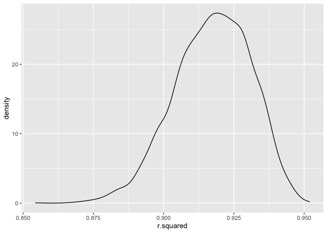

Homework 6
================
Laura O’Carroll
2023-11-28

## Problem 2

First we will download the data.

``` r
weather_df = 
  rnoaa::meteo_pull_monitors(
    c("USW00094728"),
    var = c("PRCP", "TMIN", "TMAX"), 
    date_min = "2022-01-01",
    date_max = "2022-12-31") |>
  mutate(
    name = recode(id, USW00094728 = "CentralPark_NY"),
    tmin = tmin / 10,
    tmax = tmax / 10) |>
  select(name, id, everything())
```

    ## using cached file: /Users/lauraocarroll/Library/Caches/org.R-project.R/R/rnoaa/noaa_ghcnd/USW00094728.dly

    ## date created (size, mb): 2023-11-28 20:52:59.726532 (8.544)

    ## file min/max dates: 1869-01-01 / 2023-11-30

Let’s draw 5000 bootstrap samples and test the distribution of two
quantities estimated from these data:

- r̂2
- log(β̂1∗β̂2)

First make the function.

``` r
boot_sample = function(df) {
  sample_frac(df, replace = TRUE)
}
```

Then let’s pull 5000 samples.

``` r
boot_straps = 
  tibble(strap_number = 1:5000) |> 
  mutate(
    strap_sample = map(strap_number, \(i) boot_sample(df = weather_df))
  )

boot_straps
```

    ## # A tibble: 5,000 × 2
    ##    strap_number strap_sample      
    ##           <int> <list>            
    ##  1            1 <tibble [365 × 6]>
    ##  2            2 <tibble [365 × 6]>
    ##  3            3 <tibble [365 × 6]>
    ##  4            4 <tibble [365 × 6]>
    ##  5            5 <tibble [365 × 6]>
    ##  6            6 <tibble [365 × 6]>
    ##  7            7 <tibble [365 × 6]>
    ##  8            8 <tibble [365 × 6]>
    ##  9            9 <tibble [365 × 6]>
    ## 10           10 <tibble [365 × 6]>
    ## # ℹ 4,990 more rows

Now let’s get estimates for the two quantities of interest for each of
oursamples.

``` r
boot_results = 
  boot_straps |> 
  mutate(
    models = map(strap_sample, \(df) lm(tmax ~ tmin + prcp, data = df)),
    results = map(models, broom::tidy)
  ) |> 
  select(strap_number, models, results) |> 
  unnest(results) |> 
  select(strap_number, models, term, estimate, std.error) |>  
  mutate(
    r2 = map(models, broom::glance)
  ) |> 
  unnest(r2)

compact_boot_results =
  boot_results |> 
  select(strap_number, models, term, estimate, r.squared) |> 
  pivot_wider(names_from = term,
              values_from = estimate) |> 
  rename(beta_0 = "(Intercept)",
         beta_1 = "tmin",
         beta_2 = "prcp") |> 
  mutate(
    log_b1_b2 = log(beta_1 * beta_2)
  )
```

    ## Warning: There was 1 warning in `mutate()`.
    ## ℹ In argument: `log_b1_b2 = log(beta_1 * beta_2)`.
    ## Caused by warning in `log()`:
    ## ! NaNs produced

``` r
compact_boot_results
```

    ## # A tibble: 5,000 × 7
    ##    strap_number models r.squared beta_0 beta_1   beta_2 log_b1_b2
    ##           <int> <list>     <dbl>  <dbl>  <dbl>    <dbl>     <dbl>
    ##  1            1 <lm>       0.919   8.08  0.998  0.00182     -6.31
    ##  2            2 <lm>       0.928   7.80  1.06  -0.00671    NaN   
    ##  3            3 <lm>       0.893   8.33  0.989  0.00563     -5.19
    ##  4            4 <lm>       0.928   7.85  1.03  -0.00317    NaN   
    ##  5            5 <lm>       0.909   8.00  0.999  0.00186     -6.29
    ##  6            6 <lm>       0.923   8.17  1.01  -0.00242    NaN   
    ##  7            7 <lm>       0.918   8.41  1.00  -0.00811    NaN   
    ##  8            8 <lm>       0.942   7.75  1.04  -0.00627    NaN   
    ##  9            9 <lm>       0.916   7.82  1.01   0.00497     -5.29
    ## 10           10 <lm>       0.931   7.90  1.03  -0.00381    NaN   
    ## # ℹ 4,990 more rows

Importantly, because many of the $\hat{\beta_2}$ values calculated are
negative, the $log(\hat{\beta_1} * \hat{\beta_2})$ value is going to be
`NaN` for these samples, and therefore will be eliminated when plotting
the distribution.

``` r
compact_boot_results |> 
  ggplot(aes(x = r.squared)) + 
  geom_density()
```

<!-- -->

The distribution of the $\hat{r^2}$ values is negatively skewed, with
the mode existing around 0.94.

``` r
compact_boot_results |> 
  ggplot(aes(x = log_b1_b2)) +
  geom_density()
```

    ## Warning: Removed 3376 rows containing non-finite values (`stat_density()`).

<!-- -->

The distribution of the $log(\hat{\beta_1} * \hat{\beta_2})$ values is
also negatively skewed, with the mode existing approximently -5.5.

``` r
compact_boot_results |> 
  summarize(
    rsq_ci_lower = quantile(r.squared, 0.025),
    rsq_ci_upper = quantile(r.squared, 0.975),
    log_beta_ci_lower = quantile(log_b1_b2, 0.025, na.rm = TRUE),
    log_beta_ci_upper = quantile(log_b1_b2, 0.975, na.rm = TRUE)
  ) |> 
  knitr::kable(digits = 3)
```

| rsq_ci_lower | rsq_ci_upper | log_beta_ci_lower | log_beta_ci_upper |
|-------------:|-------------:|------------------:|------------------:|
|        0.888 |         0.94 |            -9.202 |            -4.567 |

The estimate of $\hat{r^2}$ is 0.9170022, 95% CI \[0.8881248,
0.9404097\]. The estimate of $log(\hat{\beta_1} * \hat{\beta_2})$ is
-6.138258, 95% CI \[-9.2024158, -4.5665181\].

It’s important to note that because the value of
$log(\hat{\beta_1} * \hat{\beta_2})$ is the result of trying to take the
logarithm of a negative number, these are `NaN` and are not included
when calculating the estimate and confidence interval.

## Problem 3

Now we will analyze data to understand the effect of several variables
on a child’s birthweight.

First I’ll load and tidy the data.

``` r
birthweight_df = 
  read_csv("data/birthweight.csv") |> 
  mutate(
    babysex = case_match(
    babysex,
    1 ~ "male",
    2 ~ "female"
  ),
  babysex = as.factor(babysex),
  frace = case_match(
    frace,
    1 ~ "white",
    2 ~ "black",
    3 ~ "asian",
    4 ~ "puerto rican",
    8 ~ "other",
    9 ~ "unknown"
  ),
  frace = as.factor(frace),
  malform = case_match(
    malform, 
    0 ~ "absent",
    1 ~ "present"
  ),
  malform = as.factor(malform),
  mrace = case_match(
    mrace,
    1 ~ "white",
    2 ~ "black",
    3 ~ "asian",
    4 ~ "puerto rican",
    8 ~ "other",
  ),
  mrace = as.factor(mrace), 
  bwt_lbs = bwt* 0.00225,
  mheight_cm = mheight * 2.54,
  fincome_full = fincome * 100)
```

    ## Rows: 4342 Columns: 20
    ## ── Column specification ────────────────────────────────────────────────────────
    ## Delimiter: ","
    ## dbl (20): babysex, bhead, blength, bwt, delwt, fincome, frace, gaweeks, malf...
    ## 
    ## ℹ Use `spec()` to retrieve the full column specification for this data.
    ## ℹ Specify the column types or set `show_col_types = FALSE` to quiet this message.

``` r
birthweight_df |> 
  summarise(across(everything(), ~ sum(is.na(.x))))
```

    ## # A tibble: 1 × 23
    ##   babysex bhead blength   bwt delwt fincome frace gaweeks malform menarche
    ##     <int> <int>   <int> <int> <int>   <int> <int>   <int>   <int>    <int>
    ## 1       0     0       0     0     0       0     0       0       0        0
    ## # ℹ 13 more variables: mheight <int>, momage <int>, mrace <int>, parity <int>,
    ## #   pnumlbw <int>, pnumsga <int>, ppbmi <int>, ppwt <int>, smoken <int>,
    ## #   wtgain <int>, bwt_lbs <int>, mheight_cm <int>, fincome_full <int>

``` r
birthweight_df
```

    ## # A tibble: 4,342 × 23
    ##    babysex bhead blength   bwt delwt fincome frace gaweeks malform menarche
    ##    <fct>   <dbl>   <dbl> <dbl> <dbl>   <dbl> <fct>   <dbl> <fct>      <dbl>
    ##  1 female     34      51  3629   177      35 white    39.9 absent        13
    ##  2 male       34      48  3062   156      65 black    25.9 absent        14
    ##  3 female     36      50  3345   148      85 white    39.9 absent        12
    ##  4 male       34      52  3062   157      55 white    40   absent        14
    ##  5 female     34      52  3374   156       5 white    41.6 absent        13
    ##  6 male       33      52  3374   129      55 white    40.7 absent        12
    ##  7 female     33      46  2523   126      96 black    40.3 absent        14
    ##  8 female     33      49  2778   140       5 white    37.4 absent        12
    ##  9 male       36      52  3515   146      85 white    40.3 absent        11
    ## 10 male       33      50  3459   169      75 black    40.7 absent        12
    ## # ℹ 4,332 more rows
    ## # ℹ 13 more variables: mheight <dbl>, momage <dbl>, mrace <fct>, parity <dbl>,
    ## #   pnumlbw <dbl>, pnumsga <dbl>, ppbmi <dbl>, ppwt <dbl>, smoken <dbl>,
    ## #   wtgain <dbl>, bwt_lbs <dbl>, mheight_cm <dbl>, fincome_full <dbl>

The model has 4342 observations and 23 variables named .

To build a model that predicts birth weight (‘bwt’), I will consider
factors that reflect the mother’s demographics, with the theory that the
mother’s socioeconomic factors are major drivers of heath and heathcare
access. I will evaluate the impact of the mother’s weight at delivery,
the family’s monthly income, the mother’s height, the mother’s age at
delivery, and the mother’s race.

This model will be named `fit_one`.

``` r
fit_one = lm(bwt ~ delwt + fincome + mheight + momage + mrace, data = birthweight_df) 

fit_one %>%
  broom::tidy() %>%
  knitr::kable()
```

| term              |     estimate |   std.error |  statistic |   p.value |
|:------------------|-------------:|------------:|-----------:|----------:|
| (Intercept)       | 1649.4549023 | 191.5614520 |  8.6105784 | 0.0000000 |
| delwt             |    6.1524144 |   0.3510755 | 17.5244760 | 0.0000000 |
| fincome           |    0.5602689 |   0.3047548 |  1.8384253 | 0.0660681 |
| mheight           |   11.1764820 |   3.0033629 |  3.7213225 | 0.0002007 |
| momage            |    0.0538125 |   2.0155546 |  0.0266986 | 0.9787013 |
| mraceblack        | -327.4634832 |  73.3389392 | -4.4650698 | 0.0000082 |
| mracepuerto rican | -140.0433886 |  78.0488081 | -1.7943053 | 0.0728341 |
| mracewhite        |  -28.9064296 |  72.6215357 | -0.3980421 | 0.6906187 |

Next I will interpret the model:

The following variables were found to be signifcantly associated with
birthweight: the mother’s weight at delivery (p-value = \< 0.0000), the
mother’s height (p-value = 0.0002), and if the mother was Black (p-value
= \< 0.0000). Other mothers’ races, the family income, and the mothers
age at birth were not significantly associated at a 95% confidence
interval.

- The expected change per pound increase in mother’s weight at delivery
  is an increase in birth weight of 6.15 grams, with all other
  predictors held constant.

- The expected change per one inch increase in maternal height at
  delivery is an increase in birth weight of 11.18 grams, with all other
  predictors held constant.

- The expected change if the mother is Black is a decrease of 327.5
  grams, with all other predictors held constant.

``` r
birthweight_df %>%
  modelr::add_residuals(fit_one) %>%
  modelr::add_predictions(fit_one) %>%
  ggplot(aes(x = pred, y = resid)) +
  geom_point()
```

<!-- -->

Here we demonstrate a plot of the model’s predicted values for
birthweight plotted against the residual values from my model. There is
wide variability to the residuals, with most from -1000 to +1000, and
most of the predicted values being between 2500 and 3500 grams for
birthweight.

Next we will construct the models described by the homework.

The Main model will be named `fit_two`, and predicts birthweight from
baby’s length at birth and gestational age in weeks.

``` r
fit_two = lm(bwt ~ blength + gaweeks, data = birthweight_df)
fit_two %>%
  broom::tidy() %>%
  knitr::kable()
```

| term        |    estimate | std.error | statistic | p.value |
|:------------|------------:|----------:|----------:|--------:|
| (Intercept) | -4347.66707 | 97.958360 | -44.38281 |       0 |
| blength     |   128.55569 |  1.989891 |  64.60439 |       0 |
| gaweeks     |    27.04673 |  1.717930 |  15.74379 |       0 |

``` r
birthweight_df %>%
  modelr::add_residuals(fit_two) %>%
  modelr::add_predictions(fit_two) %>%
  ggplot(aes(x = pred, y = resid)) +
  geom_point() 
```

<!-- -->

Model interpretations:

For each additional increase of baby’s birth length of 1 centimeter, the
estimated change in birth weight is 128.56 gram increase, all other
predictors held constant.

For each additional gestational week of age, the estimated change in
birth weight is 27.05 gram increase, all other predictors held constant.

For the residual plot, compared to my model the residuals are somewhat
tighter with a range between 1000 and -1000, but with wider spread for
predicted birth weight between about 2000 and 4000 grams.

The next model will be named `fit_three`, and predicts birthweight from
baby’s head circumference, baby’s length at birth, the sex of the baby,
and interaction terms amongst them all: baby’s head circumference \*
baby’s length at birth, baby’s head circumference \* sex of baby, baby’s
length at birth \* baby’s sex, and baby’s head circumference \* baby’s
length at birth \* baby’s sex.

``` r
fit_three = lm(bwt ~ bhead + blength + babysex + bhead*blength + bhead*babysex + blength*babysex + bhead*blength*babysex, data = birthweight_df)

fit_three %>%
  broom::tidy() %>%
  knitr::kable()
```

| term                      |     estimate |    std.error |  statistic |   p.value |
|:--------------------------|-------------:|-------------:|-----------:|----------:|
| (Intercept)               |  -801.948671 | 1102.3077046 | -0.7275180 | 0.4669480 |
| bhead                     |   -16.597546 |   34.0916082 | -0.4868514 | 0.6263883 |
| blength                   |   -21.645964 |   23.3720477 | -0.9261475 | 0.3544209 |
| babysexmale               | -6374.868351 | 1677.7669213 | -3.7996150 | 0.0001469 |
| bhead:blength             |     3.324444 |    0.7125586 |  4.6655020 | 0.0000032 |
| bhead:babysexmale         |   198.393181 |   51.0916850 |  3.8830816 | 0.0001047 |
| blength:babysexmale       |   123.772887 |   35.1185360 |  3.5244319 | 0.0004288 |
| bhead:blength:babysexmale |    -3.878053 |    1.0566296 | -3.6702106 | 0.0002453 |

``` r
birthweight_df %>%
  modelr::add_residuals(fit_three) %>%
  modelr::add_predictions(fit_three) %>%
  ggplot(aes(x = pred, y = resid)) +
  geom_point()
```

<!-- -->

To interpret the changes per value, we must now consider the value of
the predictor’s Beta, as well as the interaction terms.

When compared to the prior two models, the residual range is a bit
tighter now primarily focused in -500 to +500 range, with still a wide
range of predicted values similar to the main model from about 2000 to
4000.

Next we will set up cross validation of 100 splits. This will include
variables for the each of the three above models, mapping the models
across the cross-validation dataframe. We will then then calculate the
root mean squared errors (RMSE) for each of those models by mapping
across them.

``` r
cv_df = 
  crossv_mc(birthweight_df, 100) 

cv_df = 
  cv_df |> 
  mutate(
    fit_one  = map(train, \(df) lm(bwt ~ delwt + fincome + mheight + momage + mrace, data = df)), #fit_one = lm(bwt ~ delwt + fincome + mheight + momage + mrace, data = birthweight_df) 
    fit_two  = map(train, \(df) lm(bwt ~ blength + gaweeks, data = df)), #fit_two = lm(bwt ~ blength + gaweeks, data = birthweight_df)
    fit_three  = map(train, \(df) lm(bwt ~ bhead + blength + babysex + bhead*blength + bhead*babysex + blength*babysex + bhead*blength*babysex, data = df))) |>  #fit_three = lm(bwt ~ bhead + blength + babysex + bhead*blength + bhead*babysex + blength*babysex + bhead*blength*babysex, data = birthweight_df)
  mutate(
    rmse_one = map2_dbl(fit_one, test, \(mod, df) rmse(model = mod, data = df)),
    rmse_two = map2_dbl(fit_two, test, \(mod, df) rmse(model = mod, data = df)),
    rmse_three = map2_dbl(fit_three, test, \(mod, df) rmse(model = mod, data = df)))
```

Lastly we will plot the density of the RMSE of the cross-validations to
see which model is optimal.

``` r
cv_df |> 
  select(starts_with("rmse")) |> 
  pivot_longer(
    everything(),
    names_to = "model", 
    values_to = "rmse",
    names_prefix = "rmse_") |> 
  mutate(model = fct_inorder(model)) |> 
  ggplot(aes(x = model, y = rmse)) + geom_violin()
```

<!-- -->

My own model had the highest RMSE, which suggests that it was the least
accurate when compared to model two and model three. Model three, which
considered the interactions of several variables, had the lowest RMSE
and therefore was the most accurate.
